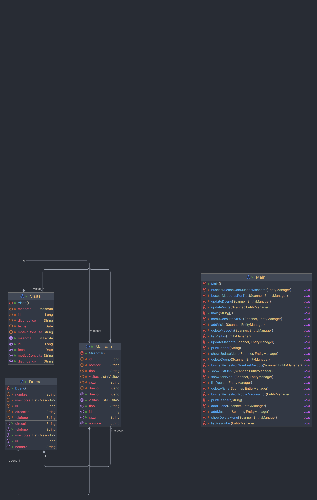

# Sistema de Gestión de Clínica Veterinaria - Documentación

## 1. Introducción

### Propósito de la Documentación
Esta documentación tiene como propósito proporcionar una visión clara y detallada del Sistema de Gestión de Clínica Veterinaria, cubriendo su arquitectura, modelo de datos, funcionalidades y configuración.

### Descripción General del Sistema
El sistema de gestión de clínica veterinaria está diseñado para facilitar la administración eficiente de una clínica veterinaria. Permite la gestión de dueños, mascotas y visitas, proporcionando funcionalidades para registrar y actualizar información relevante.

## 2. Arquitectura del Sistema

### Estructura del Proyecto
El proyecto sigue un patrón MVC (Modelo-Vista-Controlador), donde el modelo representa las entidades de la base de datos, la vista corresponde a la interacción del usuario con el sistema y el controlador gestiona la lógica del negocio.

### Diagrama de Clases

## 3. Modelo de Datos

### Entidades

#### Dueño
- **Atributos**: nombre (String), dirección (String), teléfono (String).
- **Relaciones**: One-to-Many con Mascota.
- **Anotaciones JPA**: @Entity, @OneToMany.

#### Mascota
- **Atributos**: nombre (String), tipo (String), raza (String).
- **Relaciones**: Many-to-One con Dueño, One-to-Many con Visita.
- **Anotaciones JPA**: @Entity, @ManyToOne, @OneToMany.

#### Visita
- **Atributos**: fecha (Date), motivoConsulta (String), diagnostico (String).
- **Relaciones**: Many-to-One con Mascota.
- **Anotaciones JPA**: @Entity, @ManyToOne.

## 4. Consultas JPQL

El sistema utiliza JPQL (Java Persistence Query Language) para realizar consultas a la base de datos de manera robusta y portátil. Las siguientes son algunas de las consultas clave usadas:

- **Buscar Mascotas por Tipo**:
  `SELECT m FROM Mascota m WHERE m.tipo = :tipo`
  Esta consulta recupera todas las mascotas de un tipo específico, como 'Perro' o 'Gato'.

- **Buscar Dueños con Más de 2 Mascotas**:
  `SELECT d FROM Dueno d WHERE SIZE(d.mascotas) > 2`
  Utilizada para identificar dueños que tienen más de dos mascotas.

- **Buscar Visitas por Nombre de Mascota**:
  `SELECT v FROM Visita v WHERE v.mascota.nombre = :nombreMascota`
  Filtra las visitas asociadas a una mascota específica por su nombre.

- **Buscar Visitas por Motivo de 'Vacunación'**:
  `SELECT v FROM Visita v WHERE v.motivoConsulta = 'Vacunación'`
  Selecciona todas las visitas que tienen como motivo 'Vacunación'.

Estas consultas son utilizadas en diversas partes del sistema para ofrecer información detallada y actualizada a los usuarios.

## 5. Configuración y Despliegue

### Configuración del Proyecto

#### Configuración de la Base de Datos
Para configurar la base de datos, se requiere:

1. Crear una base de datos H2 o configurar una base de datos de su elección.
2. Configurar el archivo `persistence.xml` con los detalles de conexión a la base de datos.

#### Configuración del Entorno de Desarrollo
Para configurar el proyecto en un IDE como IntelliJ IDEA:

1. Clonar el repositorio del proyecto.
2. Importar el proyecto como un proyecto Maven.
3. Configurar el SDK de Java, preferiblemente Java 11 o superior.
4. Verificar que todas las dependencias Maven estén correctamente importadas.

### Despliegue del Proyecto
Para desplegar y ejecutar el proyecto:

1. Compilar el proyecto utilizando Maven con el comando `mvn clean install`.
2. Ejecutar el archivo JAR generado o ejecutar la clase principal desde el IDE.
3. Asegurarse de que la base de datos esté en ejecución y accesible.

## 6. Conclusiones y Posibles Mejoras

### Reflexiones sobre el Desarrollo
El desarrollo del sistema fue un ejercicio enriquecedor que puso a prueba nuestras habilidades en la creación de aplicaciones con Java y JPA, ofreciendo una base sólida para comprender la persistencia de datos y la interacción con bases de datos.

### Áreas de Mejora y Características Futuras
- **Interfaz de Usuario Gráfica**: Implementar una interfaz gráfica para mejorar la interacción del usuario con el sistema.
- **Autenticación y Seguridad**: Añadir un sistema de autenticación para los usuarios y mejorar la seguridad de la aplicación.
- **Reportes y Estadísticas**: Desarrollar una funcionalidad para generar reportes y estadísticas sobre las mascotas y visitas.

---
